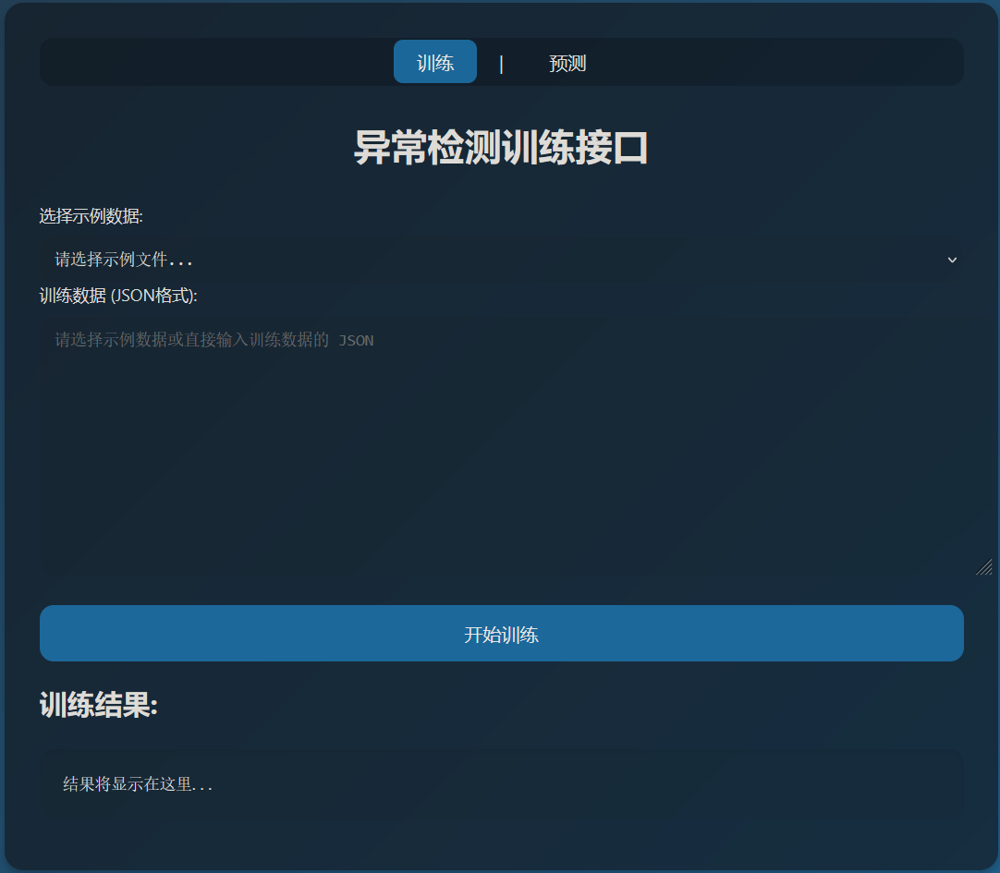

# Anomaly Detection

## 准备工作
### 安装 Docker
使用 Docker 提供的自动安装脚本进行安装
```bash
# 在国内网络环境下，推荐将安装源设置为 TUNA 等镜像以加速下载。
export DOWNLOAD_URL="https://mirrors.tuna.tsinghua.edu.cn/docker-ce"  
curl -fsSL https://get.docker.com/ | sudo -E sh 
```
执行这个命令后，脚本就会自动的将一切准备工作做好，并且把 Docker 的稳定(stable)版本安装在系统中

> [!WARNING]
>
> Docker 需要 root 权限才能够安装。如果你不信任上述代码，你可以按照 [Get Started | Docker](https://docs.docker.com/get-started/) 中的指引手动安装 Docker

接下来，你需要将你的用户添加到 docker 用户组中：
```bash
sudo usermod -aG docker $USER
```
> [!TIP]
>
> 只有在 docker 用户组中的用户才能够使用 Docker。默认情况下，只有 root 用户处于 docker 组中，因此若你不希望每次使用 Docker 时都需要输入 sudo，你需要将你的用户添加到 docker 组中

### 导入镜像
将离线的镜像文件导入到本地的 docker 中，
```bash
docker load -i anomalydetec.tar
```
查看本地镜像列表，确认镜像是否已成功导入
```bash
docker images
```
将显示镜像的名称，Tag信息：
```bash
REPOSITORY                  TAG       IMAGE ID       CREATED       SIZE
anomalydetec                latest    fc68112b806a   2 days ago    1.45GB
```

### 启动容器运行镜像
```bash
docker run -d -p 5000:5000 --name anomalydetec anomalydetec:latest
```
运行命令后将在后台运行容器并返回容器ID, 将本地主机的 5000 端口映射到容器内的 5000 端口，到此整个后端服务便已经启动.

- 运行 `docker ps` 查看正在运行的容器信息
- 运行`docker stop anomalydetec` 暂停容器运行
- 运行 `docker start anomalydetec` 启动容器

## 使用测试
使用 `ifconfig` 命令可以轻松查看当前机器的 IP 地址，然后使用同一内网下的设备浏览器打开 `服务器ip:5000` 即可进入服务器后端简易的测试页面



## 接口约定

## 训练
接受用户在 URL `/train` 下发送的 POST 请求,请求体中的 JSON 格式的参数如下

- eqID: 设备名
- chamberID: 腔体名
- recipe: 配方名
- parameterName: 参数名称
- trainingMode: 训练模式选择
  - "0": 重新训练训练或覆盖现有模型
  - "1": 增量训练（在现有模型基础上继续训练）
- labelMode: 训练数据类型
  - "0": 数据未打标（无监督学习）
  - "1": 数据已打标（监督学习）
- Wafer: 包含多个晶圆的数据记录的数组。每个晶圆的数据包括以下字段：
  - WaferName: 晶圆名称
  - processTime: 工艺时间序列，记录每个数据点的时刻
  - values: 每个时刻的工参数值
  - label: 晶圆异常标记
    - "0"：正常
    - "1": 异常

Note: 当 trainingMode 为增量时，labelMode 必须为已打标. eqID, chamberID, recipe, parameterName 决定一条 Raw Trace 的唯一ID，模型保存于 `models/eqID_chamberID_recipe_parameterName_svm_classifier.pkl`

实例如下：
```json
{
  "eqID": "EQ02",
  "chamberID": "CH03",
  "recipe": "Recipe2",
  "parameterName": "Temperature",
  "modelName": "model_0",
  "trainingMode": 0
  "labelMode": "1",
  "Wafers": [
    {
      "WaferName": "X250312.20250202#5",
      "processTime":  [1.996, 3.996, 4.996, 6.996, 7.996]，
      "values": [2.3, 12，4, 1.2, 3.5, 10.23]
      "label": "0"
    },
    {
      "WaferName": "X250312.20250202#5",
      "processTime":  [1.996, 3.996, 4.996, 6.996, 7.996]，
      "values": [2.3, 12，4, 1.2, -1, -1]
      "label": "1" 
    },
  ]
}
```
训练成功后的返回json值
```json
{                                                                 
  "status": "success",
  "message": "Training completed successfully",                   
  "training_time": 6.20168662071228
  "model_path": "models\\EQ01_CH01_Recipe1_Param1",
}
```

## 推理
接受用户在 URL `/predict` 下发送的 POST 请求，请求体中的 JSON 格式的参数如下
- eqID: 设备名
- chamberID: 腔体名
- recipe: 配方名
- parameterName: 参数名称
- labelMode: 输入数据类型
  - "0": 数据未打标，模型预测出每片Wafer的标签
  - "1": 数据已打标，用于测试模型准确率
- Wafer: 包含多个晶圆的数据记录的数组。每个晶圆的数据包括以下字段：
  - WaferName: 晶圆名称
  - processTime: 工艺时间序列，记录每个数据点的时刻
  - values: 每个时刻的工参数值
  - label: 晶圆异常标记
    - "0"：正常
    - "1": 异常

Note: 
1. 预测时，系统会根据 eqID、chamberID、recipe 和 parameterName 加载对应的模型文件。模型文件路径为：`models /eqID_chamberID_recipe_parameterName_svm_classifier.pkl`

实例如下：
```json
{
  "eqID": "EQ02",
  "chamberID": "CH03",
  "recipe": "Recipe2",
  "parameterName": "Temperature",
  "modelName": "model_0",
  "labelMode": "0"
  "Wafer": {
    "WaferName": "X250312.20250202#5",
    "processTime": [1.996, 3.996, 4.996, 6.996, 7.996],
    "values": [2.3, 12.4, 1.2, 3.5, 10.23]
  }
}
```

当 labelMode 为 "0" 时，推理时间，返回异常 Wafer 的名称：
```json
{
  "anomalies": [
    "Abnormal_596af122",
    "Abnormal_3befa644",
    "Abnormal_6764105f",
    "Abnormal_3fdebb76",
    "Abnormal_c1256cd8",
    "Abnormal_d76d2ecf"
  ],
  "inference_time": 0.5681629180908203,
  "message": "Prediction completed successfully",
  "status": "success"
}
```
当 labelMode 为 "1" 时，返回预测准确率，推理时间，以及预测错误的 Wafer：
```json
{
  "accuracy": 0.7142857142857143,
  "inference_time": 0.05095338821411133,
  "message": "Validation completed successfully",
  "status": "success",
  "wrong": [
    "Abnormal_ab0e8196",
    "Abnormal_93de205c"
  ]
}
```